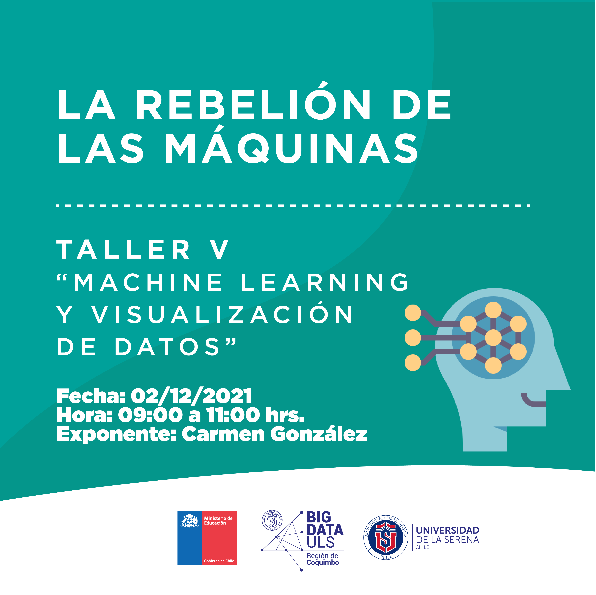

# Taller V  
Machine Learning y Visualización de datos

   

## Referencias
**[1]** Numpy  - [Documentación Oficial](https://numpy.org/)  
**[2]** Pandas - [Documentación Oficial](https://pandas.pydata.org/docs/user_guide/index.html)  
**[3]** Matplotlib - [Documentación Oficial](https://matplotlib.org/stable/contents.html)  
**[4]** Markdown - [Documentación Oficial](https://www.markdownguide.org/basic-syntax/)  
**[5]** Google colaboratory - [Documentación Oficial](https://colab.research.google.com)  
**[6]** Proyecto Jupyter - [Documentación Oficial](https://jupyter.org/documentation)